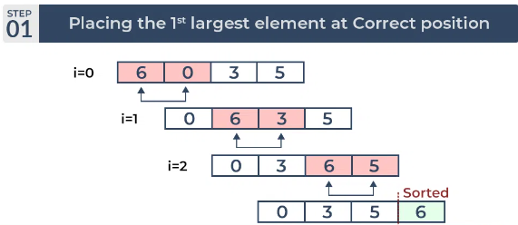
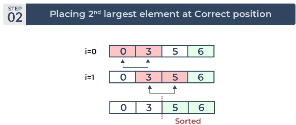
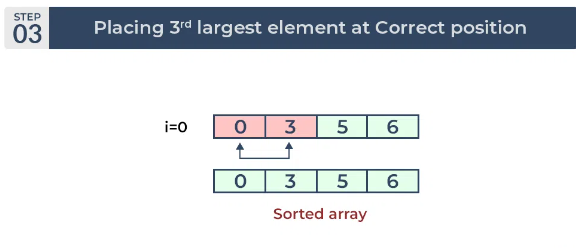

# RETO 10 Media noche en guatavita 

### PUNTO 1

##### Desarrollar un algoritmo que calcule el promedio de un arreglo de reales.

Para este punto le pedi al usuario que ingrese el número de datos que desea incluir en la lista, cree una lista vacia. Ahora estableci un ciclo for de 0 hasta los datos que desee ingrese al usuario, ejemplo si es 5, este for le pedira al usuario que ingrese 5 números y los añadira a la lista.

Luego estableci una variable suma y un ciclo for que pase por cada dato de la lista, sumandose entre ellos. Siendo luego del ciclo la variable suma, la suma de todos los datos. Para luego establecer la ultima variable, promedio, que sera igual a la variable suma dividida el número de datos de la lista (con la función len(lista)) y al imprimirla tendremos el promedio de la lista

```
elementos = int(input("Cuantos elementos quieres mi bro? "))
numeros_reales= []
for total in range(elementos):
  total = float(input("Ingresa el número, que sea real por favor: "))
  numeros_reales.append(total)

suma_nums: int = 0
for i in numeros_reales:
  suma_nums += i
promedio = (suma_nums/len(numeros_reales))
print("El promedio de " +str(numeros_reales)+ " es " +str(promedio))
```

### PUNTO 2

##### Desarrollar un algoritmo que calcule el producto punto de dos arreglos de números enteros (reales) de igual tamaño.

Para crear las listas hice lo mismo que en el punto 1, pero las dos listas al tener que ser iguales, dependeran del mismo valor inicial. Posterior a eso una variable igual a 0, que se intrdozuca en un ciflo for que multiplique las dos listas en orden, osea primer dato lista 1 * primer dato lista 2, y vaya sumando estas multipliaciones hasta que se acaben los datos de la lista.

Imprimir  la variable que sera igual al producto punto

```
elementos = int(input("Cuantos elementos quieres mi bro? "))
numeros_realesa= []
numeros_realesb= []

for total_a in range(elementos):
  total_a = float(input("Ingresa el número para el conjunto a, que sea real por favor: "))
  numeros_realesa.append(total_a)

for total_b in range(elementos):
  total_b = float(input("Ingresa el número para el conjunto b, que sea real por favor: "))
  numeros_realesb.append(total_b)

producto_punto : int = 0
for i in range(elementos):
  producto_punto += (numeros_realesa[i]*numeros_realesb[i])
print("El producto punto de la lista " +str(numeros_realesa)+ " y la lista" +str(numeros_realesb)+ " es " +str(producto_punto))
```

###  PUNTO 3

##### Hacer un algoritmo que deje al final de un arreglo de números todos los ceros que aparezcan en dicho arreglo

Para este punto crre dos listas vacias.

Una función que me separa todas las cifras de un número en digitos separados en una lista , y que busque dentro de esa lista cuantos ceros existen e incluya este valor dentro de una de las lsitas que estaban vacias.

Luego de eso al igual que el punto 1 y 2 el usuario elige la cantidad y los números que desee introduccir a una función y los introduzca en la otra lista vacia del inicio.

Estableci un condigo que une todos los números en un mismo entero, por ejemplo si teniamos, 10, 8 y 7 en la lista, se convertira en 1087, este número sera el que introduciremos a la función, con esto evitamos crear ciclos y solo jugamos con unir y seprar los números y sus digitos.

```
conjunto= []
ceros= []
def string_int(txt):
     conjunto_descompuesto = [int(i) for i in txt]
     ceros.append(conjunto_descompuesto.count(0))
     return conjunto_descompuesto

elementos = int(input("Cuantos elementos quieres mi bro? "))
for total in range(elementos):
  total = int(input("Ingresa el número, que sea entero por favor: "))
  conjunto.append(int(total))

unir_numeros = ''.join(map(str, conjunto))
numeros_unidos = (unir_numeros)
string_int(numeros_unidos)
print("En el conjunto " +str(conjunto)+ " hay un total de " +str(ceros)+  " ceros")
```

### PUNTO 4

##### Revisar que son los algoritmos de sorting, entender bubble-sort (enlace a implementación).

Los algoritmos de ordenamiento son técnicas utilizadas para organizar una lista de elementos en un orden específico, generalmente en orden ascendente o descendente. Hay varios algoritmos de ordenamiento, y la elección del algoritmo adecuado depende de factores como el tamaño de la lista, la eficiencia requerida y la estructura de datos utilizada. Algunos de los algoritmos de ordenamiento más conocidos:

* Ordenamiento de burbuja (Bubble Sort)
* Ordenamiento por inserción (Insertion Sort)
* Ordenamiento por selección (Selection Sort)
* Ordenamiento rápido (Quick Sort)
* Ordenamiento por mezcla (Merge Sort)
* Ordenamiento por montones (Heap Sort)
* Ordenamiento por cuenta (Counting Sort)
* Ordenamiento por radix (Radix Sort)
* Ordenamiento por cubo (Bucket Sort)

Ordenamiento de burbuja (Bubble Sort): Este algoritmo compara elementos adyacentes y los intercambia si están en el orden incorrecto. Continúa haciendo esto hasta que toda la lista esté ordenada. Es sencillo pero no es eficiente para listas grandes.




